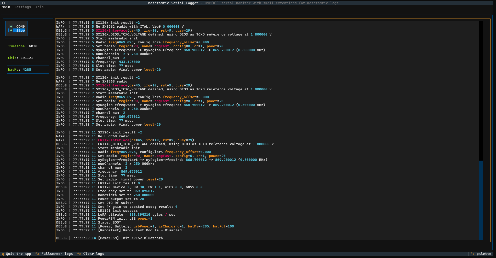

# Another one serial logger :)

## Why
I need a tool to simplify meshtastic nodes log analisys. I didn't found anything usefull, so build my own ugly coded logger.

## Possibilities
* Console UI (using Textual), works in Win console, Linux console, over SSH
* Auto reconnect to last used serial port
* Customizible labels (log parsing)

## Interface



## HowTo

### Installation 
Linux
```
python3 -m venv meshlog
cd meshlog && source bin/activate
git clone https://github.com/mrekin/meshlog.git
cd meshlog
pip3 install -r requirements.txt
```

Run
```
python3 ./slogApp.py
```

### Build binary
1. Activate venv
2. Install nuitka (preffered) or pyinstaller
   ```
   pip3 install -U nuitka
   pip3 install -U imageio
   ```
    or 
   ```
   pip3 install -U pyinstaller
   ```
4. For Linux and nuitka you may need to install
   `sudo apt install patchhelf`
5. Run script from corresponding file in scripts/


## ToDo (near future)
- [x] Autoreconnect to latest COM port
- [x] Port list autoupdates
- [ ] Custom configurable labels
  - [x] Static labels (v0.13)
  - [x] Avg labels (v0.13)
  - [x] Regexp (groups)
  - [ ] Regexp (match) - is it needed?
  - [x] String/bool result
  - [x] `dropAfter` param
  - [x] `firstEntrance` rule
  - [ ] `searchAfter` param
  - [x] Save labels to file (v0.14)
- [ ] Make working Settings tab
  - [ ] UI (usable but ugly now)
  - [x] Save/load settings (v0.12)
  - [x] Use settings in logic (v0.12)
- [x] Implement logging to file
  - [x] Single file (v0.12)
  - [x] Separate file for each COM port (v0.12)
  - [x] Separate file for each connection (v0.14)
- [ ] `Send to` logic for logs and checks/labels
- [x] Test on Windows system
- [x] Windows executable
  - [x] Manual build
  - [ ] Autobuilds
- [ ] Test on Linux system (partially tested on Ubuntu server 24.04.1 LTS over ssh)
- [ ] Linux executable
  - [ ] Manual build
  - [ ] Autobuilds
- [ ] Logs custom configurable highlights
- [x] Github releases (v0.12)
- [ ] Readme updates (installation/usage/etc)
## ToDo (far future)
- [ ] Use Meshtastic library
  - [ ] Use not only serial connection, but IP/Bluetooth
  - [ ] Get/upload node config
  - [ ] Get node status
  - [ ] Trigger DFU mode
  - [ ] (?) Trigger reboot/nodeinfo send/etc
- [x] NRF52 flashing
  - [x] Upload fullerase uf2
  - [x] Upload newest bootloader
  - [x] Upload firmware
  - [ ] Open serial after flashing
